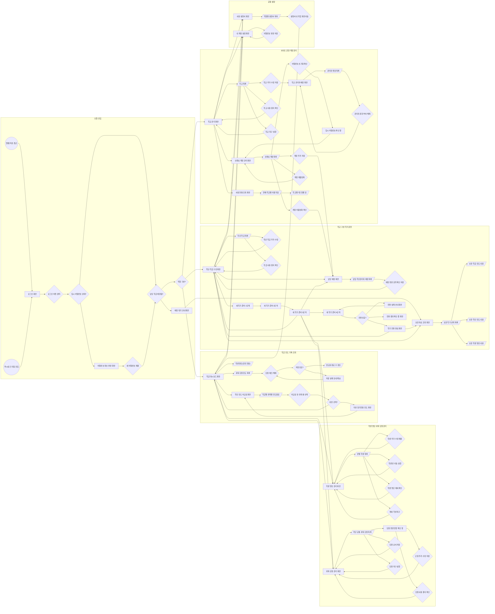

```mermaid
flowchart LR

  subgraph s1 ["인증·진입"]
    n1(("앱/웹 최초 접근"))
    n2(("푸시/링크 직접 진입"))
    n3["로그인 화면"]
    n4{"로그인 버튼 클릭"}
    n5{"임시 비밀번호 상태?"}
    n6["비밀번호 최초 변경 화면"]
    n7{"새 비밀번호 제출"}
    n8{"담당 학급 배정됨?"}
    n9["배정 대기 안내 화면"]
    n10{"역할 구분?"}
  end

  subgraph s2 ["학급 진도 기록·조회"]
    n11["학급 대시보드 화면"]
    n12[/"과목·단원 진도 목록"/]
    n13{"단원 체크·해제"}
    n14[/"진도율·완료 수 갱신"/]
    n15{"저장 성공?"}
    n16["저장 실패 안내 패널"]
    n17[/"학생 명단(조회 전용)"/]
    n18["학년 진도 비교표 화면"]
    n19[/"학급별·과목별 진도율표"/]
    n20{"비교표 반·과목 셀 선택"}
    n21{"내 반 선택?"}
    n22["타반 읽기전용 진도 화면"]
  end

  subgraph s3 ["학생 명단·과목 단원 관리"]
    n23["학생 명단 관리 화면"]
    n24[/"반별 학생 목록"/]
    n25{"학생 추가·수정 제출"}
    n26{"학생 반 이동 실행"}
    n27{"학생 명단 제외 확인"}
    n28{"제외 학생 복구"}
    n29["과목·단원 관리 화면"]
    n30[/"학년 공통 과목·단원 목록"/]
    n31["단원 변경 영향 확인 창"]
    n32{"단원 추가·수정 저장"}
    n33{"단원 사용 중지 확인"}
    n34{"단원 순서 저장"}
    n35{"단원 복구 실행"}
  end

  subgraph s4 ["학교 구성·학기 운영"]
    n36["학년·학급 구성 화면"]
    n37[/"학년·학급 목록"/]
    n38{"학년·학급 추가·수정"}
    n39{"학급 사용 중지 확인"}
    n40["담당 배정 화면"]
    n41[/"담임·학년관리자 배정 목록"/]
    n42{"배정 변경 요약 확인 저장"}
    n43["새 학기 준비 1단계"]
    n44["새 학기 준비 2단계"]
    n45["새 학기 준비 3단계"]
    n46["새 학기 준비 4단계"]
    n47{"전환 성공?"}
    n48["학기 전환 완료 화면"]
    n49["전환 실패 안내 화면"]
    n50["전환 결과 확인 중 화면"]
    n51["보관 자료 조회 화면"]
    n52[/"보관 학기 선택 목록"/]
    n53[/"보관 학급 진도 내용"/]
    n54[/"보관 학년 진도 내용"/]
    n55[/"보관 학생 명단 내용"/]
  end

  subgraph s5 ["사이트 운영·계정 관리"]
    n56["학교 관리 화면"]
    n57[/"학교 목록"/]
    n58{"학교 추가·수정 저장"}
    n59{"학교 사용 중지 확인"}
    n60{"학교 복구 실행"}
    n61["학교 관리자 배정 화면"]
    n62[/"관리자 계정 목록"/]
    n63{"관리자 권한 부여·해제"}
    n64["선생님 계정 관리 화면"]
    n65[/"선생님 계정 목록"/]
    n66{"계정 추가 저장"}
    n67{"비밀번호 초기화 확인"}
    n68["임시 비밀번호 확인 창"]
    n69{"계정 비활성화 확인"}
    n70{"계정 재활성화"}
    n71["사용 현황 조회 화면"]
    n72[/"전체·학교별 이용 지표"/]
    n73[/"학교별 7일 일별 표"/]
  end

  subgraph s6 ["공통·설정"]
    n74["사용 설명서 화면"]
    n75[/"역할별 설명서 목차"/]
    n76{"설명서 내 작업 화면 이동"}
    n77["내 계정 설정 화면"]
    n78{"비밀번호 변경 저장"}
  end

  n1 --> n3
  n2 --> n3
  n3 --> n4
  n4 --> n5
  n5 --> n6
  n5 --> n8
  n6 --> n7
  n7 --> n8
  n8 --> n9
  n8 --> n10
  n10 --> n11
  n10 --> n36
  n10 --> n56
  n9 --> n51
  n11 --> n12
  n12 --> n13
  n13 --> n15
  n15 --> n14
  n15 --> n16
  n16 --> n13
  n11 --> n17
  n11 --> n18
  n18 --> n19
  n19 --> n20
  n20 --> n21
  n21 --> n11
  n21 --> n22
  n22 --> n18
  n11 --> n23
  n23 --> n24
  n24 --> n25
  n24 --> n26
  n24 --> n27
  n24 --> n28
  n25 --> n23
  n26 --> n23
  n27 --> n23
  n28 --> n23
  n11 --> n29
  n29 --> n30
  n30 --> n31
  n31 --> n32
  n31 --> n33
  n32 --> n29
  n33 --> n29
  n30 --> n34
  n30 --> n35
  n34 --> n29
  n35 --> n29
  n36 --> n37
  n37 --> n38
  n37 --> n39
  n38 --> n36
  n39 --> n36
  n36 --> n40
  n40 --> n41
  n41 --> n42
  n42 --> n36
  n36 --> n43
  n43 --> n44
  n44 --> n45
  n45 --> n36
  n45 --> n23
  n45 --> n40
  n45 --> n29
  n45 --> n46
  n46 --> n47
  n47 --> n48
  n47 --> n49
  n47 --> n50
  n48 --> n36
  n48 --> n51
  n49 --> n46
  n36 --> n51
  n51 --> n52
  n52 --> n53
  n52 --> n54
  n52 --> n55
  n56 --> n57
  n57 --> n58
  n57 --> n59
  n57 --> n60
  n58 --> n61
  n59 --> n56
  n60 --> n56
  n61 --> n62
  n62 --> n63
  n63 --> n61
  n56 --> n64
  n64 --> n65
  n65 --> n66
  n66 --> n40
  n65 --> n67
  n67 --> n68
  n68 --> n64
  n65 --> n69
  n69 --> n40
  n65 --> n70
  n70 --> n64
  n56 --> n71
  n71 --> n72
  n72 --> n73
  n11 --> n74
  n36 --> n74
  n56 --> n74
  n74 --> n75
  n75 --> n76
  n76 --> n11
  n11 --> n77
  n36 --> n77
  n56 --> n77
  n77 --> n78
  n78 --> n77
```
